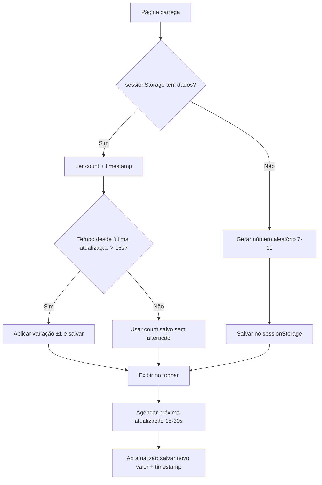

# Plano: Persistir Contagem de Visualizadores entre Páginas

## Problema

Ao navegar entre `index.html` e `politica-de-privacidade.html`, o número de "pessoas visualizando" é recalculado do zero, quebrando a ilusão de continuidade. O usuário vê, por exemplo, "10 pessoas" na home e ao clicar na política de privacidade vê "8 pessoas" instantaneamente — um salto não realista.

## Solução

Usar `sessionStorage` para compartilhar o estado do contador entre as páginas.

### Dados armazenados

| Chave | Valor | Propósito |
|-------|-------|-----------|
| `socialProof_count` | Número (7-11) | Último valor exibido |
| `socialProof_ts` | Timestamp (ms) | Momento da última atualização |

### Fluxo



## Alterações

### [MODIFY] `script.js`

Refatorar o bloco `// ===== Social Proof Top Bar =====`:

1. **No init**: verificar `sessionStorage` antes de gerar número aleatório
2. **No update**: salvar novo valor + timestamp no `sessionStorage` após cada variação
3. **Na transição**: quando o usuário muda de página, a nova página lê o estado salvo e continua de onde parou

```diff
- let currentViewers = randomInRange(MIN_VIEWERS, MAX_VIEWERS);
+ const stored = sessionStorage.getItem('socialProof_count');
+ const storedTs = sessionStorage.getItem('socialProof_ts');
+ let currentViewers;
+
+ if (stored && storedTs) {
+   currentViewers = parseInt(stored);
+   const elapsed = Date.now() - parseInt(storedTs);
+   if (elapsed > 15000) {
+     // Aplica variação se já passou tempo suficiente
+     const change = Math.random() < 0.5 ? -1 : 1;
+     currentViewers = Math.max(MIN_VIEWERS, Math.min(MAX_VIEWERS, currentViewers + change));
+   }
+ } else {
+   currentViewers = randomInRange(MIN_VIEWERS, MAX_VIEWERS);
+ }
+ sessionStorage.setItem('socialProof_count', currentViewers);
+ sessionStorage.setItem('socialProof_ts', Date.now());
```

E no `updateViewers()`:

```diff
  viewerCountEl.textContent = currentViewers;
+ sessionStorage.setItem('socialProof_count', currentViewers);
+ sessionStorage.setItem('socialProof_ts', Date.now());
```

### Nenhum outro arquivo precisa ser modificado

O `script.js` já é compartilhado entre ambas as páginas.

## Verificação

| Cenário | Resultado Esperado |
|---------|--------------------|
| Abrir `index.html` → ver "10" → ir para Política | Política mostra "10" (ou ±1 se >15s) |
| Abrir Política → ver "8" → voltar para Home | Home mostra "8" (ou ±1 se >15s) |
| Fechar aba e reabrir | Novo número aleatório (sessionStorage limpa) |
| Esperar >30s na mesma página, depois navegar | Variação natural de ±1 aplicada |
